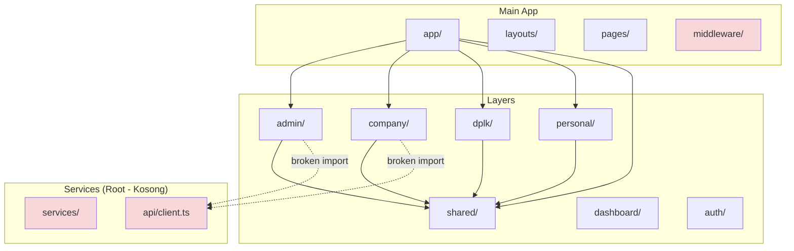

# Review Arsitektur Nuxt Layer Project

## Ringkasan Eksekutif

Project ini menggunakan arsitektur berbasis layer Nuxt, namun terdapat **ketidaksesuaian signifikan** antara dokumentasi arsitektur yang ada dengan implementasi aktual. Berikut adalah temuan utama:

---

## 1. Ketidaksesuaian Dokumentasi vs Implementasi

### 1.1 Dokumentasi Menggambarkan Arsitektur yang Berbeda

**ARCHITECTURE.md** mendokumentasikan arsitektur dengan:
- Layer: `shared`, `products`, `cart`, `reviews`, `checkout`, `auth`
- Menggunakan Zod schemas untuk validasi runtime
- Menggunakan Pinia Composition API untuk stores
- Layer `core` untuk infrastruktur

**Implementasi Aktual** menggunakan:
- Layer: `shared`, `admin`, `company`, `dplk`, `personal`, `dashboard`, `auth`
- Tidak ada layer `core`
- Menggunakan TypeScript interfaces (bukan Zod schemas)
- Menggunakan Pinia Options API (bukan Composition API)

### 1.2 IMPROVEMENTS.md Tidak Sesuai Realita

File ini menyatakan bahwa layer `core` sudah diimplementasikan dengan:
- `useApi()` composable
- `useErrorHandler()` composable
- `useLogger()` utility
- Custom error classes

**Kenyataan:** Layer `core` tidak ada dalam struktur project.

---

## 2. Struktur Layer

### 2.1 Layer yang Ada

```
layers/
├── admin/      # Admin management
├── auth/       # Authentication
├── company/    # Company portal
├── dplk/       # DPLK management
├── personal/   # Personal user portal
├── dashboard/  # Dashboard components
└── shared/     # Shared components & utilities
```

### 2.2 Masalah Konfigurasi Layer

**Setiap layer memiliki `nuxt.config.ts` yang KOSONG**

```typescript
// layers/shared/nuxt.config.ts - KOSONG
// layers/admin/nuxt.config.ts - KOSONG
// dll.
```

Konfigurasi layer seharusnya berisi:
```typescript
export default defineNuxtConfig({
  $meta: {
    name: 'layer-name',
    description: 'Layer description',
  },
})
```

### 2.3 ESLint Layer Boundaries Tidak Sinkron

[`eslint.config.mjs`](eslint.config.mjs:168-181) mendefinisikan layer boundaries untuk:
- `core`, `shared`, `products`, `cart`, `auth`, `checkout`, `reviews`

Tapi layer yang ada adalah:
- `admin`, `company`, `dplk`, `personal`, `dashboard`

**Ini menyebabkan ESLint rule tidak berfungsi dengan benar.**

---

## 3. Pola Store (Pinia)

### 3.1 Dokumentasi: Composition API

ARCHITECTURE.md mendokumentasikan penggunaan Composition API:

```typescript
// Dokumentasi menyarankan ini:
export const useCartStore = defineStore('cart', () => {
  const items = ref<CartItem[]>([])
  // ...
})
```

### 3.2 Implementasi Aktual: Options API

Implementasi nyata menggunakan Options API:

```typescript
// layers/admin/app/stores/users/index.ts
export const useUserStore = defineStore('admin-users', {
    state: (): UserState => ({ /* ... */ }),
    getters: { /* ... */ },
    actions: { /* ... */ }
})
```

**Masalah:**
- Tidak konsisten dengan dokumentasi
- Options API lebih verbose untuk store kompleks
- Composition API lebih modern dan fleksibel

---

## 4. Validasi Data

### 4.1 Dokumentasi: Zod Schemas

ARCHITECTURE.md merekomendasikan Zod untuk runtime validation:

```typescript
// Seharusnya menggunakan Zod:
export const ProductSchema = z.object({
  id: z.string().min(1),
  name: z.string().min(1),
  price: z.number().positive(),
})
export type Product = z.infer<typeof ProductSchema>
```

### 4.2 Implementasi Aktual: TypeScript Interfaces

Implementasi menggunakan TypeScript interfaces saja:

```typescript
// layers/admin/app/types/index.ts
export interface User {
    id: string
    username: string
    email: string
    // ...
}
```

**Masalah:**
- Tidak ada validasi runtime
- Data dari API tidak divalidasi
- Potensi bug dari data yang tidak valid

---

## 5. Struktur Services

### 5.1 Services di Root Directory

Services ditempatkan di root `services/`:

```
services/
├── api/
│   ├── client.ts        # KOSONG
│   └── interceptors.ts  # KOSONG
└── modules/
    ├── auth/
    │   └── auth.service.ts  # KOSONG
    └── user/
        └── user.service.ts  # KOSONG
```

### 5.2 Services di Layer

Setiap layer juga memiliki services di dalamnya:

```
layers/admin/services/
├── dashboard.service.ts
├── master-data.service.ts
└── user.service.ts
```

**Masalah:**
- Duplikasi struktur services
- Services di root kosong/tidak digunakan
- Tidak jelas mana yang harus digunakan
- Layer services mengimpor dari `~/services/api/client` yang kosong

### 5.3 Import Path yang Tidak Konsisten

```typescript
// layers/admin/services/user.service.ts
import { apiClient } from '~/services/api/client'  // File ini KOSONG!
```

---

## 6. File Kosong / Tidak Terimplementasi

Banyak file penting yang kosong:

| File | Status |
|------|--------|
| `services/api/client.ts` | ❌ Kosong |
| `services/api/interceptors.ts` | ❌ Kosong |
| `services/modules/auth/auth.service.ts` | ❌ Kosong |
| `app/composables/useNotification.ts` | ❌ Kosong |
| `app/middleware/auth.ts` | ❌ Kosong |
| `app/middleware/guest.ts` | ❌ Kosong |
| `app/utils/constants.ts` | ❌ Kosong |
| `app/utils/formatters.ts` | ❌ Kosong |
| `app/utils/validation.ts` | ❌ Kosong |
| `app/types/api.ts` | ❌ Kosong |
| `app/types/models.ts` | ❌ Kosong |
| Semua `layers/*/nuxt.config.ts` | ❌ Kosong |

---

## 7. Nuxt Configuration Issues

### 7.1 Auto-Imports Enabled

[`nuxt.config.ts`](nuxt.config.ts:16-23) mengaktifkan auto-imports:

```typescript
imports: {
  autoImport: true,  // Bertentangan dengan dokumentasi
  dirs: [
    'app/composables',
    'app/stores',
    'app/utils'
  ]
}
```

Dokumentasi di ARCHITECTURE.md menyatakan:
> "Auto-imports are **disabled** for code clarity"

### 7.2 Layer Dependencies

[`nuxt.config.ts`](nuxt.config.ts:31-37) extends layers:

```typescript
extends: [
  './layers/shared',
  './layers/dplk',
  './layers/company',
  './layers/personal',
  './layers/admin',
],
```

Tidak ada layer `auth` dan `dashboard` di sini, padahal foldernya ada.

---

## 8. Rekomendasi Perbaikan

### 8.1 High Priority (Segera)

1. **Sinkronkan Dokumentasi dengan Implementasi**
   - Update ARCHITECTURE.md untuk mencerminkan layer yang ada
   - Atau implementasikan arsitektur yang didokumentasikan
   - Hapus atau update IMPROVEMENTS.md

2. **Implementasikan File Kosong yang Kritis**
   - `services/api/client.ts` - API client yang sebenarnya
   - `services/api/interceptors.ts` - Auth & error interceptors
   - `app/middleware/auth.ts` - Authentication middleware
   - `app/composables/useNotification.ts` - Notification system

3. **Pilih Konsistensi Store Pattern**
   - Pilih: Options API atau Composition API
   - Update dokumentasi sesuai pilihan
   - Refactor semua stores untuk konsisten

4. **Perbaiki ESLint Layer Boundaries**
   - Update config untuk layer yang ada: `admin`, `company`, `dplk`, `personal`
   - Hapus referensi ke layer yang tidak ada

### 8.2 Medium Priority

5. **Pertimbangkan Zod untuk Runtime Validation**
   - Tambah Zod schemas untuk semua types
   - Validasi data dari API
   - Validasi data sebelum disimpan ke store

6. **Tentukan Struktur Services**
   - Pilih: services di root atau di dalam layer
   - Jangan gunakan keduanya
   - Hapus struktur yang tidak digunakan

7. **Konfigurasi Layer dengan Benar**
   - Isi `nuxt.config.ts` untuk setiap layer
   - Tambah metadata layer

### 8.3 Low Priority

8. **Pertimbangkan Membuat Layer Core**
   - Pindahkan API client ke layer core
   - Pindahkan error handling ke layer core
   - Pindahkan logging ke layer core

9. **Keputusan tentang Auto-Imports**
   - Putuskan: enable atau disable
   - Update dokumentasi sesuai keputusan
   - Jika disable, update semua imports

---

## 9. Diagram Arsitektur Aktual



---

## 10. Checklist Action Items

- [ ] Sinkronkan ARCHITECTURE.md dengan implementasi
- [ ] Implementasikan `services/api/client.ts`
- [ ] Implementasikan `services/api/interceptors.ts`
- [ ] Implementasikan middleware files
- [ ] Pilih dan konsistenkan store pattern
- [ ] Update ESLint layer boundaries
- [ ] Isi semua `layers/*/nuxt.config.ts`
- [ ] Pertimbangkan implementasi Zod schemas
- [ ] Tentukan struktur services yang jelas
- [ ] Putuskan kebijakan auto-imports
- [ ] Hapus atau update IMPROVEMENTS.md

---

## 11. Kesimpulan

**Skor Kesiapan Arsitektur: 5/10**

**Kelebihan:**
- ✅ Konsep layer-based sudah diterapkan
- ✅ Struktur direktori terorganisir
- ✅ ESLint dan testing infrastructure ada

**Kekurangan:**
- ❌ Dokumentasi tidak sesuai implementasi
- ❌ Banyak file kosong/kritis tidak terimplementasi
- ❌ Tidak konsisten (store pattern, services)
- ❌ Layer boundaries tidak berfungsi
- ❌ Tidak ada runtime validation

**Saran:**
Fokus pada **High Priority** items terlebih dahulu - terutama mengimplementasikan file kosong yang kritis dan menyelaraskan dokumentasi dengan realita.
